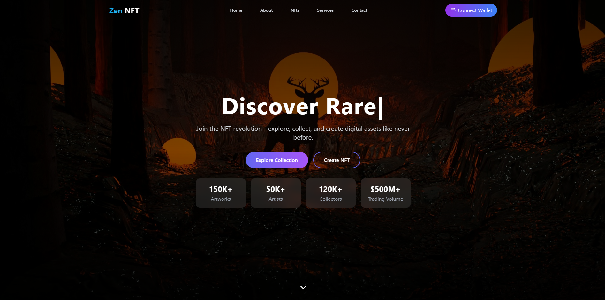
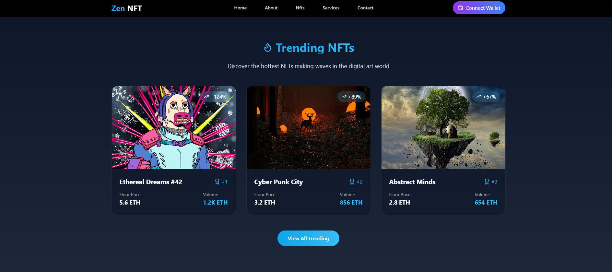
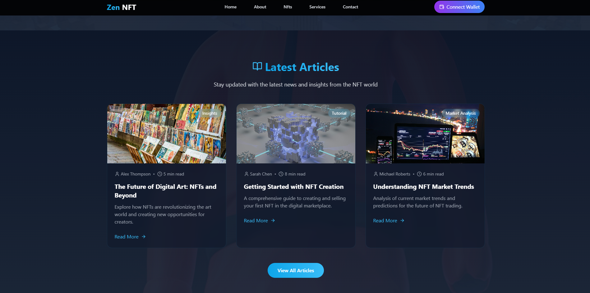
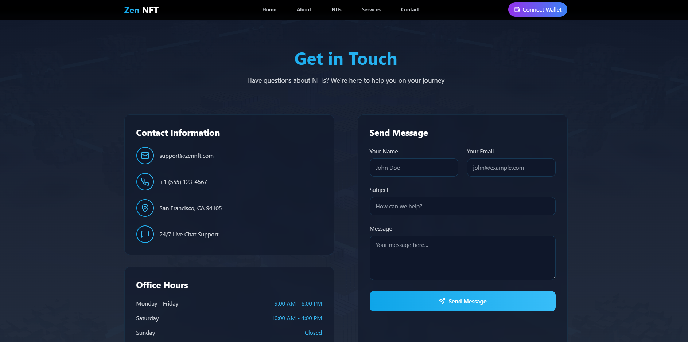

# 🌀 Zen NFT Marketplace

Welcome to **Zen NFT Marketplace** – a platform to explore, buy, sell, and trade unique digital assets and NFTs with ease and elegance. 🎨✨

  
*(Replace with an actual image of your app interface)*  

---

## 🚀 Features

- 🌟 **Explore NFTs**: Browse through a diverse collection of NFTs.  
- 💳 **Secure Transactions**: Powered by blockchain for safety and transparency.  
- 🎨 **For Creators & Collectors**: Seamlessly create, buy, and sell NFTs.  
- 🌍 **Global Reach**: Connect with enthusiasts and creators worldwide.  
- 📈 **Analytics**: Monitor trends, transactions, and growth in real time.

---

## 📸 Screenshots

### 🌟 Home Page  
  

### 🛒 NFT Details  
  

### 👤 Event Dashboard  
  

### 👤 Contact Page
  


---

## 🔧 Tech Stack

- **Frontend**: React, Tailwind CSS, Framer Motion  

---

## 🛠️ Installation & Setup

1. **Clone the repository**:  
   ```bash
   git clone https://github.com/your-username/zen-nft-marketplace.git
   cd zen-nft-marketplace
   ```

2. **Install dependencies**:  
   ```bash
   npm install
   ```

3. **Start the development server**:  
   ```bash
   npm start
   ```

4. **Backend Setup** (optional):  
   - Navigate to the backend directory:
     ```bash
     cd backend
     ```
   - Install dependencies and start the server:
     ```bash
     npm install
     npm run start
     ```

5. **View in Browser**:  
   Open [http://localhost:3000](http://localhost:3000) to explore.

---

## 📜 License

This project is licensed under the **MIT License**.  
Feel free to use, modify, and distribute with attribution.

---

## 🤝 Contributing

We welcome contributions!  

1. Fork the project.  
2. Create a new branch (`git checkout -b feature/AmazingFeature`).  
3. Commit your changes (`git commit -m 'Add some AmazingFeature'`).  
4. Push to the branch (`git push origin feature/AmazingFeature`).  
5. Open a Pull Request.

---

## 🧑‍💻 Authors

- **Ishan Dhananjana** – *Full-Stack Developer*  


---

## 🌟 Acknowledgements

- **OpenAI** – For assisting in development.  
- **React** – For a robust frontend framework.  
- **Unsplash** – Placeholder images used during development.  

---

## 📞 Contact

Have questions? Feel free to reach out!  
  
🌐 Website: [Ishan Dhananjana](https://ishand.netlify.app)  
 

--- 


